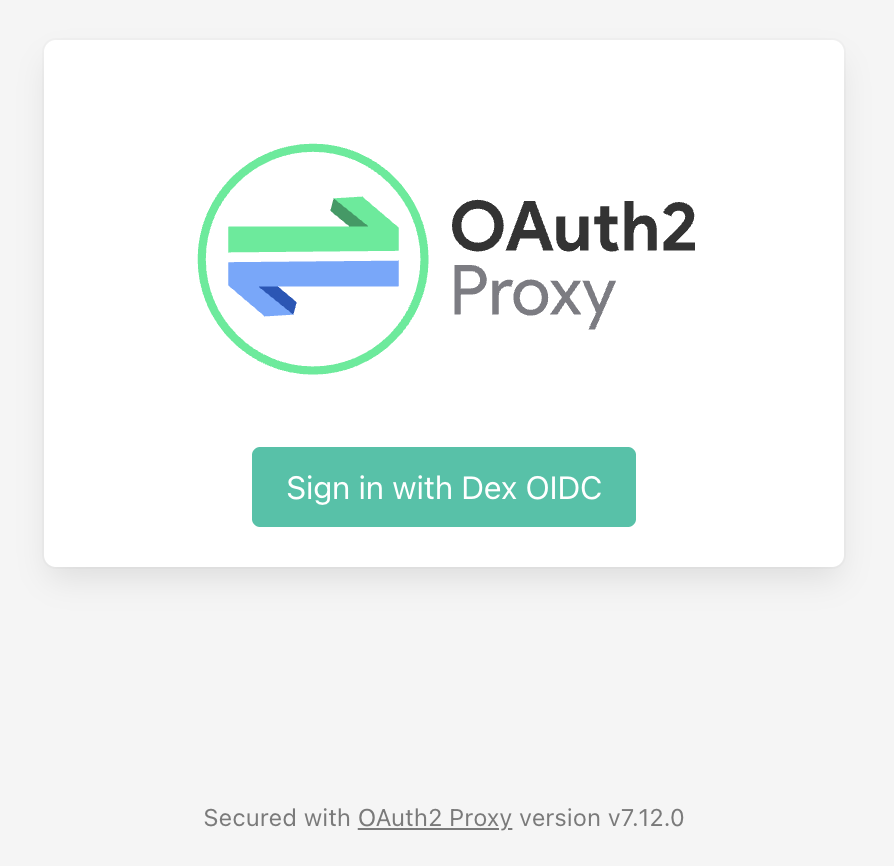
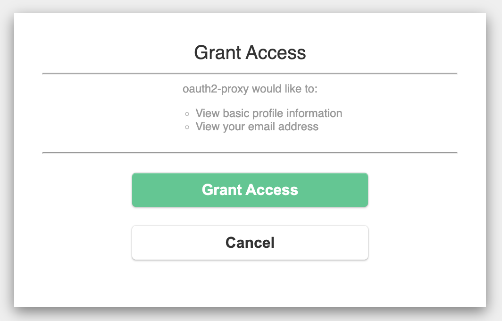
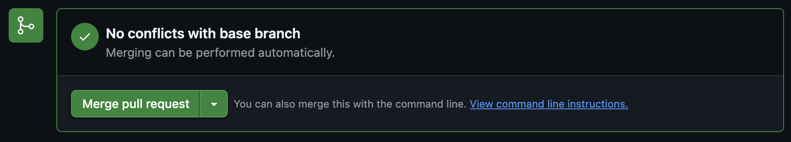
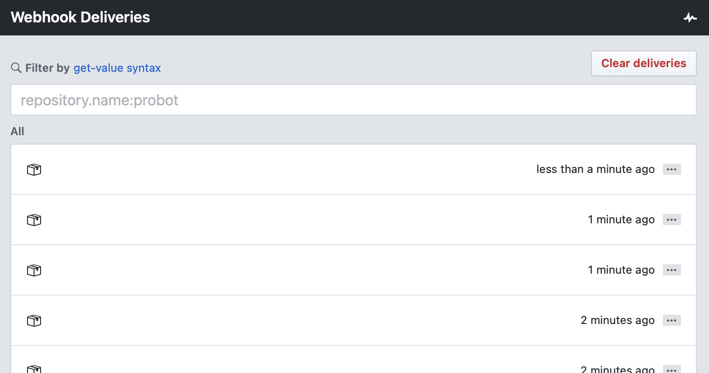

Konflux-CI
===

<!-- toc -->

- [Document Conventions](#document-conventions)
- [Trying Out Konflux](#trying-out-konflux)
  * [Machine Minimum Requirements](#machine-minimum-requirements)
  * [Installing Software Dependencies](#installing-software-dependencies)
  * [Bootstrapping the Cluster](#bootstrapping-the-cluster)
  * [Enable Pipelines Triggering via Webhooks](#enable-pipelines-triggering-via-webhooks)
  * [Onboard a new Application](#onboard-a-new-application)
    + [Option 1: Onboard Application with the Konflux UI](#option-1-onboard-application-with-the-konflux-ui)
      - [Create Application and Component via the Konflux UI](#create-application-and-component-via-the-konflux-ui)
    + [Option 2: Onboard Application with Kubernetes Manifests](#option-2-onboard-application-with-kubernetes-manifests)
      - [Image Registry](#image-registry)
      - [Creating a Pull Request](#creating-a-pull-request)
    + [Observe the Behavior](#observe-the-behavior)
    + [Pull your New Image](#pull-your-new-image)
      - [Public Registry](#public-registry)
      - [Local Registry](#local-registry)
      - [Start a Container](#start-a-container)
    + [Integration Tests](#integration-tests)
      - [Configure Integration Tests](#configure-integration-tests)
      - [Add Customized Integration Tests (Optional)](#add-customized-integration-tests-optional)
    + [Configure Releases](#configure-releases)
      - [Create ReleasePlan and ReleasePlanAdmission Resources](#create-releaseplan-and-releaseplanadmission-resources)
      - [Create a Registry Secret for the Managed Namespace](#create-a-registry-secret-for-the-managed-namespace)
      - [Trigger the Release](#trigger-the-release)
    + [Working with External Image Registry (Optional)](#working-with-external-image-registry-optional)
      - [Push Pull Request Builds to External Registry](#push-pull-request-builds-to-external-registry)
      - [Use External Registry for on-push Pipeline](#use-external-registry-for-on-push-pipeline)
  * [Resource (Memory & CPU) Management](#resource-memory--cpu-management)
    + [Workloads Deployed *with* Konflux](#workloads-deployed-with-konflux)
    + [Workloads Deployed *by* Konflux](#workloads-deployed-by-konflux)
  * [Namespace and User Management](#namespace-and-user-management)
    + [Creating a new Namespace](#creating-a-new-namespace)
    + [Granting a User Access to a Namespace](#granting-a-user-access-to-a-namespace)
    + [Users Management](#users-management)
  * [Repository Links](#repository-links)

<!-- tocstop -->

# Document Conventions

:gear: - **Action Required**: This symbol signifies that the text to follow it requires
the reader to fulfill an action.

# Trying Out Konflux

This section demonstrates the process for deploying Konflux locally, onboarding users,
and building and releasing an application. The procedure contains two options for the
user to choose from for onboarding applications to Konflux:

- Using the Konflux UI
- Using Kubernetes manifests

Each of these options has its pros and cons. The Konflux UI procedure provides a more
streamlined user experience once you finish installing and configuring it. However,
it requires using [Quay.io](https://quay.io) for image registry, plus some additional
initial setup steps compared to using a Kubernetes manifest alone.

**Note:** You can configure your server to operate the same way using either the
Konflux UI method or the terminal and Kubernetes manifests procedure. For example,
you can also configure Konflux to support an image registry using the terminal process.

In both cases, the recommended way to try out Konflux is using [Kind](https://kind.sigs.k8s.io).
This guide will walk you through creating a Kind cluster using the `kind-config.yaml`
manifest, located in the root directory of this repository. This manifest tells
[Kind](https://kind.sigs.k8s.io) to forward port `9443` from the host to the
[Kind](https://kind.sigs.k8s.io) cluster. Kind must configure this port forwarding
to access Konflux.

**Note**: For security reasons, Konflux limits browser access to the local server.
If you are using a remote machine to set up Konflux, you'll need to use SSH to set
up port forwarding to access Konflux through your local computer's browser. To do this,
open an additional terminal and type the following command:

```bash
ssh -L 9443:localhost:9443 <remote_host_user_name>@<remote_host_ip_address>
```

## Machine Minimum Requirements

Konflux currently only supports the **x86_64 Linux** platform.

The deployment requires the following **free** resources:

- **CPU**: 4 cores
- **RAM**: 8 GB

**Note**: You will need to add more resources if you plan to run multiple pipelines in parallel.

## Installing Software Dependencies

:gear: Verify that you have the following applications installed on your host machine

- **git** (v2.46 or newer)
- **golang** (v1.24.6 or newer)
- **[Kind](https://kind.sigs.k8s.io/docs/user/quick-start)** (v0.26.0 or newer) along with **podman** (v5.3.1 or newer)
or **docker** (v27.0.1 or newer)
- **kubectl** (v1.31.1 or newer)
- **make** (v4.4.1 or newer)
- **openssl** (v3.2.2 or newer)

## Bootstrapping the Cluster

:gear: Before you can bootstrap and configure your cluster, you will need to clone the Konflux
repository and enter the project directory by typing these commands in your terminal (from this point
on, the documentation will assume that you've cloned this project into your home directory):

```bash
cd ~

git clone https://github.com/konflux-ci/konflux-ci.git

cd konflux-ci
```

**Note**: We recommend you increase the `inotify` resource limits to avoid issues with having
[too many open files](https://kind.sigs.k8s.io/docs/user/known-issues/#pod-errors-due-to-too-many-open-files).

To increase the limits temporarily, run the following commands:

```bash
sudo sysctl fs.inotify.max_user_watches=524288

sudo sysctl fs.inotify.max_user_instances=512
```

Once you're in the `konflux-ci` project directory, you're ready to create your cluster via
these steps:

1. :gear: Create a cluster

    ```bash
    kind create cluster --name konflux --config kind-config.yaml
    ```

    **Note:** When using Podman, we recommend increasing the PID limit of the container running the cluster,
    as the default setting may not be sufficient when the cluster becomes busy.

    ```bash
    podman update --pids-limit 4096 konflux-control-plane
    ```

    **Note:** If your pods still fail to start due to missing resources, you may need to reserve additional
    resources for the [Kind](https://kind.sigs.k8s.io) cluster. To do so, edit the
    [kind-config.yaml](./kind-config.yaml) file in the root directory of the `konflux-ci` project
    (you should currently be here) and modify the `system-reserved` line under `kubeletExtraArgs`.

    ```yaml
    ---
    kind: Cluster
    apiVersion: kind.x-k8s.io/v1alpha4
    nodes:
    - role: control-plane
      kubeadmConfigPatches:
      - |
        kind: InitConfiguration
        nodeRegistration:
          kubeletExtraArgs:
            node-labels: "ingress-ready=true"
            system-reserved: memory=12Gi        <--- Edit this line (the default is 8Gi)
      extraPortMappings:
      - containerPort: 30010
        hostPort: 8888
        protocol: TCP
        # UI
      - containerPort: 30011
        hostPort: 9443
        protocol: TCP
        # PaC
      - containerPort: 30012
        hostPort: 8180
        protocol: TCP
    ```

2. :gear: Deploy the dependencies

    ```bash
    ./deploy-deps.sh
    ```

3. :gear: Deploy Konflux

    ```bash
    ./deploy-konflux.sh
    ```

    **Note**: If you get an error about "accumulating resources" during the `Deploying Release Service`
    portion of this script, it is due to a bug in some versions of **kustomize**. To fix the issue:

    1. Uninstall your current version of **kustomize** and install version 5.7.1 or later.

    2. Clone the following git repositories to your local machine, placing them all in your `$HOME`
    directory where you cloned `konflux-ci`:

        ```bash
        https://github.com/konflux-ci/release-service
        https://github.com/konflux-ci/integration-service
        https://github.com/konflux-ci/build-service
        ```

    3. Go into the `release-service` directory and checkout this specific branch:

        ```bash
        git checkout d2012b5b0bab0d88408176903351d8909f93b3aa
        ```

    4. Go into the `integration-service` directory and checkout this specific branch:

        ```bash
        git checkout cec5d540d177c5cbe73f58d1628684fa78d35199
        ```

    5. Go into the `build-service` directory and checkout this specific branch:

        ```bash
        git chekcout 3c62370e82ccdacd32e4da335b215b6f88703df3
        ```

    6. Edit the `~konflux-ci/konflux-ci/release/core/kustomization.yaml` file. Change this line:

       ```bash
       - https://github.com/konflux-ci/release-service/config/default?ref=d2012b5b0bab0d88408176903351d8909f93b3aa
       ```

       To this:

       ```bash
       - ../../../../release-service/config/default
       ```

    7. Edit the `~/konflux-ci/konflux-ci/integration/core/kustomization.yaml` file. Change these two lines:

        ```bash
        - https://github.com/konflux-ci/integration-service/config/default?ref=cec5d540d177c5cbe73f58d1628684fa78d35199
        - https://github.com/konflux-ci/integration-service/config/snapshotgc?ref=cec5d540d177c5cbe73f58d1628684fa78d35199
        ```

        To this:

        ```
        - ../../../../integration-service/config/default
        - ../../../../integration-service/config/snapshotgc
        ```

    8. Edit the `~/konflux-ci/konflux-ci/build/core/kustomization.yaml` file. Change this line:

        ```bash
        - https://github.com/konflux-ci/build-service/config/default?ref=3c62370e82ccdacd32e4da335b215b6f88703df3
        ```

        To this:

        ```bash
        - ../../../build-service/config/default
        ```

    9. Edit the `~/konflux-ci/deploy-konflux.sh` file and replace these three lines to ensure
    the script is calling the right version of `kustomize` (these three lines are in
    different areas of the file, not together):

        ```bash
        retry kubectl apply -k "${script_path}/konflux-ci/release"

        retry kubectl apply -k "${script_path}/konflux-ci/integration"

        retry kubectl apply -k "${script_path}/konflux-ci/build-service"
        ```

        With these three lines:

        ```bash
        kustomize build ./konflux-ci/release/ | kubectl apply -f - --server-side --force-conflicts

        kustomize build ./konflux-ci/integration/ | kubectl apply -f - --server-side --force-conflicts

        kustomize build ./konflux-ci/build-service/ | kubectl apply -f - --server-side --force-conflicts
        ```

    10. From the root of the `konflux-ci` directory, run the `./deploy-konflux.sh` script
    again. It should work without error this time.

4. :gear: Deploy demo users

    ```bash
    ./deploy-test-resources.sh
    ```

5. :gear: As a reminder, if you've installed Konflux on a remote host, you will need to configure SSH port
forwarding to access your cluster. To do this, open an additional terminal and run the following command
(make sure to add the details for your remote user and IP address):

    ```bash
    ssh -L 9443:localhost:9443 <remote_host_user_name>@<remote_host_ip_address>
    ```

6. Once you've set up port forwarding, your cluster's UI will be available at https://localhost:9443.
   You can log in using the test user's account.

    **username**: **user@konflux.dev**
    **password**: **password**

    You now have Konflux up and running. Next, we'll configure Konflux to respond to pull request webhooks,
    build a user application, and push it to a registry.

## Enable Pipelines Triggering via Webhooks

You can configure Konflux to trigger pipelines anytime someone submits a pull request.

You can also configure Konflux to send the outcomes of these triggers back to your
project's Pull request tab in GitHub. You will need to have a GitHub repository
available to create webhooks that Tekton will listen to. When deployed in a local
environment, such as [Kind](https://kind.sigs.k8s.io), GitHub will not be able
to reach the services within your cluster. For this reason, we must use a proxy
to listen for such events from within the cluster and then replay them internally.

To achieve this, we rely on a webhook payload delivery service called [smee](https://smee.io).
To use [smee](https://smee.io), we configure a GitHub repository to send events
to a channel that we create on a public [smee](https://smee.io) server. Then,
we deploy a client within the cluster to listen for those events. This client
will relay those events to pipelines-as-code (Tekton) inside the cluster.

When you deployed dependencies earlier, the process created a [smee](https://smee.io)
channel for you, deployed a client to listen to that channel, and stored the
channel's **Webhook Proxy URL** in a patch file.

1. :gear: Take note of the smee channel's **Webhook Proxy URL** created for you.
If you already have a channel that you'd like to keep using, copy
its URL to the `value` field inside the `smee-channel-id.yaml` file and rerun
`deploy-deps.sh`. The script will not recreate the patch file if it already exists.

    To retrieve the auto-generated [smee](https://smee.io) URL:

    `grep value dependencies/smee/smee-channel-id.yaml`

2. :gear: Create a GitHub app following the
   [Create a Pipelines-as-Code GitHub App](https://pipelinesascode.com/docs/install/github_apps/#manual-setup)
   documentation.

    - For `Homepage URL` you can insert `https://localhost:9443/` (it doesn't matter).

    - For the `Webhook URL` insert the [smee](https://smee.io) client's **Webhook
    Proxy URL** from the previous step.

As per the [Pipelines as Code](https://pipelinesascode.com/docs/install/github_apps/#manual-setup)
link above, generate and download the private key and create a secret on the
cluster, providing the location of the private key, the App ID, and the
openssl-generated secret created during the process.

To allow Konflux to send pull requests to your application repositories,
the same secret should be created inside the build-service and the integration-service
namespaces. For additional details, refer to the
[Configuring GitHub Application Secrets](./docs/github-secrets.md) documentation.

## Onboard a new Application

The next step is to onboard an application to Konflux on behalf of user2.

**Note**: The `deploy-test-resources.sh` script created the `user2` account for you.

This section includes two options for onboarding an application to Konflux.

The first option demonstrates using the Konflux UI to onboard an application
and release its builds to [Quay.io](https://quay.io).

The second option demonstrates the use of Kubernetes manifests to onboard and
release builds to a container registry deployed to the cluster. The idea
behind this scenario is to simplify onboarding and demonstrate Konflux with greater ease.

Both options will use an example repository containing a Dockerfile to be
built by Konflux. Before we get started, you'll need to complete these steps:

1. :gear: Fork the [example repository](https://github.com/konflux-ci/testrepo)
   by clicking its **Fork** button and following the instructions on the **Create a new fork** page

2. :gear: Install the GitHub App you created in the previous section on your fork by doing the following:

    1. Go to your [Applications page on GitHub](https://github.com/settings/apps).

    2. Click on your GitHub App (if you haven't done so yet, follow the instructions on the
    [Create a Pipelines-as-Code GitHub App](https://pipelinesascode.com/docs/install/github_apps/#manual-setup)
    page.

    3. Click on the **Install App** link on the left-hand side of the page.

    4. Select your GitHub account (this should be the same account you forked
    the [example repository](https://github.com/konflux-ci/testrepo) to in Step 1).

    5. Select the **Only select repositories** radio button.

    6. Select your forked example repository.

    7. Click the **Install** button.

We will use our Konflux deployment to build and release pull requests for this fork.

### Option 1: Onboard Application with the Konflux UI

With this approach, Konflux can create:

1. Manifests in GitHub for the application pipelines it will run.

2. The [Quay.io](https://quay.io) repositories into which it will push container images.

You can configure the first item by creating
[GitHub Application Secrets](https://github.com/konflux-ci/konflux-ci/blob/main/docs/github-secrets.md)
for the `pipelines-as-code`, `build-service`, and `integration-service` namespaces,
and then installing your newly created GitHub App on your repository, as explained above.

To configure these three namespaces, run the following commands from the terminal of your Konflux server:

1. Configure the `pipelines-as-code` namespace.
    ```
    kubectl -n pipelines-as-code create secret generic pipelines-as-code-secret \
            --from-literal github-private-key="$(cat <path_to_your_private_key_file>)" \
            --from-literal github-application-id=<your_app_id> \
            --from-literal webhook.secret="<your_webhook_secret>"
    ```

2. Configure the `build-service` namespace.
    ```
    kubectl -n build-service create secret generic pipelines-as-code-secret \
            --from-literal github-private-key="$(cat <path_to_your_private_key_file>)" \
            --from-literal github-application-id=<your_app_id> \
            --from-literal webhook.secret="<your_webhook_secret>"
    ```

3. Configure the `integration-service` namespace.
    ```
    kubectl -n integration-service create secret generic pipelines-as-code-secret \
            --from-literal github-private-key="$(cat <path_to_your_private_key_file>)" \
            --from-literal github-application-id=<your_app_id> \
            --from-literal webhook.secret="<your_webhook_secret>"
    ```

To achieve the second item, create an organization and an application
in [Quay.io](https://quay.io) that will allow Konflux to create
repositories for your applications. To do that, follow the steps below.

**Note**: You can also reference the
[Quay.io Configurations](https://github.com/konflux-ci/konflux-ci/blob/main/docs/quay.md#automatically-provision-quay-repositories-for-container-images)
document for more information.

1. :gear: Log in to or create a user account on [Quay.io](https://quay.io).

    1. Go to [Quay.io](https://quay.io).

    2. Log in using your Red Hat credentials, or create a new account if you don't have one.

    3. Click on your profile picture in the top-right corner and select **Account Settings**.

    4. Click on the **User Settings** icon (represented by three gears).

    5. You should see a message about Docker using plaintext passwords. Click on
    the button to generate an encrypted password.

    6. You should see an overlay with icons and links down the left side. Click on
    the **Docker Configuration** link.

    7. You should now see a link to download a credential file in JSON format,
    along with a terminal command that you can use to copy this file into the correct location.
    Download the file onto your Konflux server.

    8. Create a `.docker` directory within your `$HOME` directory on your Konflux server.

    9. Copy the file to the proper location by typing
    `mv <your-account-name>-auth.json ~/.docker/config.json`
    in the terminal of your Konflux server.

2. :gear: Create an Organization on [Quay.io](https://quay.io).

    1. Click the **+** sign next to the search bar and select **New Organization**.

    2. Fill out the form and click the **Create Organization** button.

    3. Go to the [Organizations](https://quay.io/organizations/) page to see your organizations.

    4. Click on the organization you just created.

    5. Click on the **Robot Account** tab (represented by a robot icon).

    6. Click on the **Create Robot Account** button.

    7. Fill out the form and click on the **Create robot account** button.

    8. After creating your Robot Account, click on the account name to display the credentials overlay.

    9. Click on the **Robot Account** tab on the overlay.

    10. In a terminal on the Konflux server, create the `image-controller-system` namespace.

    ```
    kubectl create namespace image-controller-system
    ```

    11. Create the secret containing your [Quay.io](https://quay.io) Robot Account credentials
    in the pipeline's `user-ns2` namespace using this command:
    ```
    kubectl create secret generic quay-robot-secret \
            --from-literal=username=<your-org>+<robot-name> \
            --from-literal=password=<robot-token> \
            -n user-ns2
    ```

    12. Add your Robot Account credentials to the `image-controller-system` namespace.

    ```
    kubectl create secret generic quay-robot-secret \
            --from-literal=username=<your-org+robot-name> \
            --from-literal=password=<the-long-token-string> \
            -n image-controller-system
    ```

    **Note**: If you make a mistake and need to redo this command, you must first
    delete the `quay-robot-secret` namespace before you can recreate it. You can
    do this with the following command:

    ```
    kubectl delete secret quay-robot-secret -n image-controller-system
    ```

3. :gear: Download, configure, and deploy the `image-controller` project.

    1. Clone the image-controller project onto your Konflux server.

    2. Edit the `image-controller/config/manager/manager.yaml` file. Look
    for a line that says `image: controller:latest` and add the following
    code beneath it. The `env:` key should be at the same indentation
    level as `image: controller:latest`.

        You can get this information by:

        1. Going to [Organizations](https://quay.io/organizations).

        2. Clicking on your organizations name.

        3. Clicking on the **Robot Accounts** icon.

        4. Clicking on your organizations robot name.

        5. Clicking on the **Robot Account** tab at the top of the overlay dialog.

        ```
        ...
        image: controller:latest
        env:
        - name: QUAY_ORGANIZATION
          value: "<your-org-name>"
        - name: QUAY_API_TOKEN_SECRET_NAME
          value: "<your-org-robot-name>"
        - name: QUAY_API_TOKEN_SECRET_KEY
          value: "<your-org-robot-secret-key>"
        ...
        ```

    3. Change directories into your `image-controller` project directory
    and run `make deploy`.

4. :gear: Create an Application and a Component via the Konflux UI.

    1. :gear: Go to your [Konflux](https://localhost:9443) web console.

    2. :gear: Click on the `Sign in with Dex OIDC` button.

        

    3. :gear: Log in using these credentials:

        **Username**: `user2@konflux.dev`
        **Password**: `password`

    4. :gear: Click on the `Grant Access` button to access the web console.

        

    5. :gear: Click the **View my namespaces** button.

    6. :gear: Click the **user-ns2** link.

    7. :gear: Click on the **Create application** button.

    8. :gear: Enter an application name (we'll use the name `my-app-one` in
    this documentation, but you can use any name you prefer).

    9. :gear: Click the **Create application** button.

    10. :gear: On the `my-app-one` application screen, click on the **Components** tab.

    11. :gear: Click on the **Add component** button.

    12. :gear: In a separate browser tab, go to the Git repository you
    forked from `https://github.com/konflux-ci/testrepo`.

    13. :gear: Click on the **Code** button.

    14. :gear: Click on HTTPS and copy the URL (it should end in `.git`).

    15. :gear: Go back to your Konflux browser tab and paste the Git
    URL into the **Get repository URL** field.

    16. :gear: Change the component name in the **Component name**
    field if you wish, or you can accept the default name.

    17. :gear: Set the **Pipeline** drop-down list to `docker-build-oci-ta`
    if it isn't already.

    18. :gear: Leave all other fields blank or set to their default settings.

    19. :gear: Click the **Add component** button.

    **Note**: If you encounter a `404 Not Found` error, refer to the
    [troubleshooting guide](https://github.com/konflux-ci/konflux-ci/blob/main/docs/troubleshooting.md#unable-to-create-application-with-component-using-the-konflux-ui).

Now, if you click on the **Components** tab in the Konflux UI, you
should see the component you just created.

**Note**: If you have *NOT* completed the [Quay.io](https://quay.io) setup
steps in the previous section, Konflux will be *UNABLE* to send pull requests
to your repository.

In your GitHub repository, you should now see that Konflux created a pull
request with two new pipelines. Konflux triggers one pipeline when pull request
events occur, such as when you create or modify pull requests, and another
when push events occur, such as when you merge a pull request.

You have successfully onboarded your application, and you can continue to the
[next step](#observe-the-behavior).

### Option 2: Onboard Application with Kubernetes Manifests

With this approach, we use `kubectl` to deploy the manifests for creating
the Application and Component resources, and we manually create the pull
request to configure and run the pipelines using Konflux.

Let's step through the process of deploying a manifest via the terminal.

1. :gear: Edit the `application-and-component.yaml` for the `user-ns2`
namespace, which is located here:

    ```bash
    ~/konflux-ci/test/resources/demo-users/user/ns2/application-and-component.yaml
    ```

2. :gear: Under the `Component` and `Repository` sections, change
the URL fields so they point to the fork you created from the `testrepo` Git
repository: `https://github.com/<your-github-username>/testrepo`.

**Note**: There is a subtle difference between the formatting of the two fields.
The `Component` URL has a `.git` suffix and is not surrounded by quotes,
while the `Repository` URL doesn't have a `.git` extension and is
surrounded by quotes.

3. :gear: Once you have finished editing the example manifest, please
run the following command to deploy it.

```
kubectl create -f ./test/resources/demo-users/user/ns2/application-and-component.yaml
```

Now, log in to the Konflux web console if you aren't already.

**Username**: `user2@konflux.dev`
**Password**: `password`

You should be able to see your new Application and Component by clicking
on the **Applications** tab. Both the Application and Component should be
called `test-component`. You should also see the Application and Component
you created in the previous section, for a total of two of each.

#### Image Registry

The build pipeline that you're about to run pushes the images it builds
to an image registry.

For the sake of simplicity, it's configured to use a registry deployed
into the cluster when we installed all the dependencies.

**Note**: The statement above is only true when not onboarding via
the Konflux UI. You can convert it to use a public image registry later on.

#### Creating a Pull Request

You're now ready to create your first pull request. **Please make sure that
your pull request targets YOUR FORK'S MAIN BRANCH and not a branch from the
`https://github.com/konflux-ci/testrepo` project**.

1.️ :gear: Clone your `testrepo` fork and create a new branch called `add-pipelines`.

```
git clone <my-fork-url>
cd <my-fork-name>
git checkout -b add-pipelines
```

2. :gear: Tekton will trigger pipelines present in the `.tekton` directory. The pipelines
already exist in your repository, but you need to copy them to this location,
create a pull request, and merge it into your fork of the `testrepo` repository.

```
mkdir -p .tekton
cp pipelines/* .tekton/
```

3. :gear: Commit your changes and push them to your repository.

```
git add .tekton
git commit -m "add pipelines"
git push origin HEAD
```

Your terminal should now display a link for creating a new pull request
in GitHub. Click the link to go to the page. **Again, please ensure that
the `base` repository is under your user name**.

Once you have your pull request documented and configured the way you want,
click the **Create pull request** button. We will merge your pull request in
the [Trigger the Release](#trigger-the-release) section.

### Observe the Behavior

If you have everything set up correctly, when you create your pull request, you should
see a green checkbox showing that GitHub can merge the pull request and that
your GitHub App ran successfully.



You can also check your [smee](https://smee.io) URL to see if it is processing
Webhook Deliveries.



**Note**: If you don't see these items or see a pipeline error, please consult the
[Troubleshooting Common Issues](./docs/troubleshooting.md#pr-changes-are-not-triggering-pipelines)
guide.

:gear: Log in to the Konflux UI as user2 and check your applications. Select the
application you created earlier, click on `Activity` and `Pipeline runs`. A build
should've been triggered a few seconds after the pull request was created.

Follow the build progress. Depending on your system's load and network connection (the
build process involves pulling images), it might take a few minutes for the build to
complete. It will clone the repository, build using the Dockerfile, and
push the image to the registry.

**Note**: If a pipeline is triggered, but it seems stuck for a long time, especially at
early stages, refer to the troubleshooting document's running out of resources
[section](./docs/troubleshooting.md#running-out-of-resources).

### Pull your new Image

When the build process is done, you can check out the image you just built by pulling it
from the registry.

#### Public Registry

If using a public registry, navigate to the repository URL mentioned in the
`output-image` value of your pull-request pipeline and locate your build.

For example, if using [Quay.io](https://quay.io/repository/), you'd need to go to the
`Tags` tab and locate the relevant build for the tag mentioned on the `output-image`
value (e.g. `on-pr-{{revision}}`), and click the `Fetch Tag` button on the right to
generate the command to pull the image.

#### Local Registry

:gear: If using a local registry, Port-forward the registry service, so you can reach it
from outside of the cluster:

```bash
kubectl port-forward -n kind-registry svc/registry-service 30001:443
```

The local registry is using a self-signed certificate that is being distributed to all
namespaces. You can fetch the certificate from the cluster and use it on the `curl`
calls below. This will look something like this:

```bash
kubectl get secrets -n kind-registry local-registry-tls \
   -o jsonpath='{.data.ca\.crt}' | base64 -d > ca.crt

curl --cacert ca.crt https://...
```

Instead, we're going to use the `-k` flag to skip the TLS verification.

Leave the terminal hanging and on a new terminal window:

:gear: List the repositories on the registry:

```bash
curl -k https://localhost:30001/v2/_catalog
```

The output should look like this:

```bash
{"repositories":["test-component"]}
```

:gear: List the tags on that `test-component` repository (assuming you did not
change the pipeline's output-image parameter):

```bash
curl -k https://localhost:30001/v2/test-component/tags/list
```

You should see a list of tags pushed to that repository. Take a note of that.

```bash
{"name":"test-component","tags":["on-pr-1ab9e6d756fbe84aa727fc8bb27c7362d40eb3a4","sha256-b63f3d381f8bb2789f2080716d88ed71fe5060421277746d450fbcf938538119.sbom"]}
```

:gear: Pull the image starting with `on-pr-` (we use `podman` below, but the commands
should be similar on `docker`):

```bash
podman pull --tls-verify=false localhost:30001/test-component:on-pr-1ab9e6d756fbe84aa727fc8bb27c7362d40eb3a4
Trying to pull localhost:30001/test-component:on-pr-1ab9e6d756fbe84aa727fc8bb27c7362d40eb3a4...
Getting image source signatures
Copying blob cde118a3f567 done   |
Copying blob 2efec45cd878 done   |
Copying blob fd5d635ec9b7 done   |
Copying config be9a47b762 done   |
Writing manifest to image destination
be9a47b76264e8fb324d9ef7cddc93a933630695669afc4060e8f4c835c750e9
```

#### Start a Container

:gear: Start a container based on the image you pulled:

```bash
podman run --rm be9a47b76264e8fb324d9ef7cddc9...
hello world
```

### Integration Tests

If you onboarded your application using the Konflux UI, the integration tests
are automatically created for you by Konflux.

On the Konflux UI, the integration tests definition should be visible in the
`Integration tests` tab under your application, and a pipeline should've been triggered for them under the `Activity` tab, named after the name of the application. You can
click it and examine the logs to see the kind of things it verifies, and to confirm it passed successfully.

Once confirmed, skip to
[adding customized integration tests](#add-customized-integration-tests-optional).

if you onboarded your application manually, you will now configure your application to
trigger integration tests after each pull request build is done.

#### Configure Integration Tests

You can add integration tests either via the Konflux UI, or by applying the equivalent
Kubernetes resource.

**NOTE:** If you have imported your component via the UI, a similar Integration Test is
pre-installed.

In our case, the resource is defined in
`test/resources/demo-users/user/ns2/ec-integration-test.yaml`.

:gear: Apply the resource manifest:

```bash
kubectl create -f test/resources/demo-users/user/ns2/ec-integration-test.yaml
```

Alternatively, you can provide the content from that YAML using the UI:

1. :gear: Login as user2 and navigate to your application and component.

2. :gear: Click the `Integration tests` tab.

3. :gear: Click `Actions` and select `Add Integration test`.

4. :gear: Fill-in the details from the YAML.

5. :gear: Click `Add Integration test`.

Either way, you should now see the test listed in the UI under `Integration tests`.

Our integration test is using a pipeline residing in the location defined under the
`resolverRef` field on the YAML mentioned above. From now on, after the build pipeline
runs, the pipeline mentioned on the integration test will also be triggered.

:gear: To verify that, go back to your GitHub pull request and add a comment: `/retest`.

On the Konflux UI, under your component `Activity` tab, you should now see the build
pipeline running again (`test-component-on-pull-request-...`), and when it's done, you
should see another pipeline run called `test-component-c6glg-...` being triggered.

You can click it and examine the logs to see the kind of things it verifies, and confirm
it passes successfully.

#### Add Customized Integration Tests (Optional)

**NOTE:** The custom integration test currently only supports testing images stored
externally to the cluster. If using the local registry, skip to
[Configure Releases](#configure-releases).

The integration tests you added just now are relatively generic
[Enterprise Contract](https://enterprisecontract.dev/) tests. The next step adds
a customized test scenario which is specific to our application.

Our simple application is a container image with an entrypoint that prints `hello world`
and exits, and we're going to add a test to verify that it does indeed print that.

An integration test scenario references a pipeline definition. In this case, the
pipeline is defined on our
[example repository](https://github.com/konflux-ci/testrepo/blob/main/integration-tests/testrepo-integration.yaml).
Looking at the pipelines definition, you can see that it takes a single parameter named
`SNAPSHOT`. This parameter is provided automatically by Konflux and it contains
references to the images built by the pipeline that triggered the integration tests.
We can define additional parameters to be passed from Konflux to the pipeline, but in
this case, we only need the snapshot.

The pipeline then uses the snapshot to extract the image that was built by the pipeline
that triggered it and deploys that image. Next, it collects the execution logs and
verifies that they indeed contain `hello world`.

We can either use the Konflux UI or the Kubernetes CLI to add the integration test
scenario.

To add it through the Konflux UI:

1. :gear: Login as user2 and navigate to your application and component.

2. :gear: Click the `Integration tests` tab.

3. :gear: Click `Actions` and select `Add Integration test`.

4. :gear: Fill in the fields:

* Integration test name: a name of your choice
* GitHub URL: `https://github.com/konflux-ci/testrepo`
* Revision: `main`
* Path in repository: `integration-tests/testrepo-integration.yaml`

5. :gear: Click `Add Integration test`.

Alternatively, you can create it using `kubectl`. The manifest is stored in
`test/resources/demo-users/user/ns2/integration-test-hello.yaml`:

1. :gear: Verify the `application` field contains your application name.

2. :gear: Deploy the manifest:

```bash
kubectl create -f ./test/resources/demo-users/user/ns2/integration-test-hello.yaml
```

:gear: Post a `/retest` comment on your GitHub pull request, and once the `pull-request`
pipeline is done, you should see your new integration test being triggered alongside
the one you had before.

If you examine the logs, you should be able to see the snapshot being parsed and the
test being executed.

### Configure Releases

You will now configure Konflux to release your application to the registry.

This requires:

* A pipeline that will run on push events to the component repository.

* `ReleasePlan` and `ReleasePlanAdmission` resources, that will react on the snapshot to
  be created after the on-push pipeline will be triggered, which, in turn, will trigger
  the creation of the release.

If onboarded using the Konflux UI, the pipeline was already created and configured for
you.

If onboarded using Kubernetes manifests then you should have copied the pipeline to the
`.tekton` directory before [creating your initial pull request](#creating-a-pull-request).

#### Create ReleasePlan and ReleasePlanAdmission Resources

Once you merge a pull request, the on-push pipeline will be triggered and once it completes, a
snapshot will be created and the integration tests will run against the container images
built on the on-push pipeline.

Konflux now needs `ReleasePlan` and `ReleasePlanAdmission` resources that will be used
together with the snapshot for creating a new `Release` resource.

The `ReleasePlan` resource includes a reference to the application that the development
team wants to release, along with the namespace where the application is supposed to be
released (in this case, `managed-ns2`).

The `ReleasePlanAdmission` resource defines how the application should be released, and
it is typically maintained, not by the development team, but by the managed environment
team (the team that supports the deployments of that application).

The `ReleasePlanAdmission` resource makes use of an Enterprise Contract (EC) policy,
which defines criteria for gating releases.

Lastly, the process also requires permissions to be granted to the managed environment
`appstudio-pipeline` service account on several resources.

For more details you can examine the manifests under the
[managed-ns2 directory](./test/resources/demo-users/user/managed-ns2/).

To do all that, follow these steps:

:gear: Edit the [release plan](./test/resources/demo-users/user/ns2/release-plan.yaml)
and verify that the `application` field contains the name of your application.

:gear: Deploy the Release Plan under the development team namespace (`user-ns2`):

```bash
kubectl create -f ./test/resources/demo-users/user/ns2/release-plan.yaml
```

Edit the `ReleasePlanAdmission`
[manifest](./test/resources/demo-users/user/managed-ns2/rpa.yaml):

**NOTE:** if you're using the in-cluster registry, you should not be required to make
any of the changes to the `ReleasePlanAdmission` manifest described below before
deploying it.

1. :gear: Under `applications`, verify that your application is the one listed.

2. :gear: Under the components mapping list, set the `name` field so it matches the name
   of your component and replace the value of the `repository` field with the URL of the
   repository on the registry to which your released images are to be pushed. This is
   typically a different repository comparing to the one builds are being pushed during
   tests.

   For example, if your component is called `test-component`, and you wish to release
   your images to a Quay.io repository called `my-user/my-konflux-component-release`,
   then the configs should look like this:

```yaml
    mapping:
      components:
        - name: test-component
          repository: quay.io/my-user/my-konflux-component-release
```

:gear: Deploy the managed environment team's namespace, along with the resources
mentioned above:

```bash
kubectl create -k ./test/resources/demo-users/user/managed-ns2
```

At this point, you can click **Releases** on the left pane in the UI. The status
for your ReleasePlan should be **"Matched"**.

#### Create a Registry Secret for the Managed Namespace

**NOTE:** if you're using the in-cluster registry, you can skip this step and proceed
to [triggering a release](#trigger-the-release).

In order for the release service to be able to push images to the registry, a secret is
needed on the managed namespace (`managed-ns2`).

The secret needs to be created on this namespace regardless of whether you used the
UI for onboarding or not, but if you weren't, then this secret is identical to the one
that was previously created on the development namespace (`user-ns2`).

:gear: To create it, follow the instructions for
[creating a push secret for the release pipeline](./docs/quay.md#configuring-a-push-secret-for-the-release-pipeline)
for namespace `managed-ns2`.

#### Trigger the Release

You can now merge your pull request and observe the behavior:

1. Merge the pull request in GitHub.

2. On the Konflux UI, you should now see your on-push pipeline being triggered.

3. Once it finishes successfully, the integration tests should run once more, and
   a release should be created under the `Releases` tab.

4. :gear: Wait for the Release to be complete, and check your registry repository for
   the released image.

**Congratulations**: You just created a release for your application!

Your released image should be available inside the repository pointed by your
`ReleasePlanAdmission` resource.

### Working with External Image Registry (Optional)

This section provides instructions if you're interested in using an external image
registry, instead of the in-cluster one.

#### Push Pull Request Builds to External Registry

First, configure your application to use an external registry instead of the internal
one used so far. In order to do that, you'd need to have a repository, on a public
registry, in which you have push permissions.
E.g. [Docker Hub](https://hub.docker.com/), [Quay.io](https://quay.io/repository/):

1. :gear: Create an account on a public registry (unless you have one already).

2. :gear: Create a
   [push secret](./docs/quay.md#configuring-a-push-secret-for-the-build-pipeline)
   based on your login information and deploy it to your user namespace on the cluster
   (e.g. `user-ns2`).

3. :gear: Create a new repository on the registry to which your images will be pushed.
   For example, in Quay.io, you'd need to click the
   [Create New Repository](https://quay.io/new/) button and provide it with name and
   location. Free accounts tend to have limits on private repositories, so for the
   purpose of this example, you can make your repository public.

4. Configure your build pipeline to use your new repository on the public registry
   instead of the local registry:

   :gear: Edit `.tekton/testrepo-pull-request.yaml` inside your `testrepo` fork
   and replace the value of `output-image` to point to your repository. For example,
   if using Quay.io and your username is `my-user` and you created a repository called
   `my-konflux-component` under your own organization, then the configs should look like this:

```yaml
  - name: output-image
    value: quay.io/my-user/my-konflux-component:on-pr-{{revision}}
```

5. :gear: Push your changes to your `testrepo` fork, either as a new pull request or as a change
   to an existing pull request. Observe the behavior as before, and verify that the build
   pipeline finishes successfully, and that your public repository contains the images
   pushed by the pipeline.

#### Use External Registry for on-push Pipeline

:gear: Edit the content of the copy you made earlier to the on-push pipeline at
`.tekton/testrepo-push.yaml`, replacing the value of `output-image`, so that the
repository URL is identical to the one
[previously set](#push-pull-request-builds-to-external-registry)
for the `pull-request` pipeline.

For example, if using Quay.io and your username is `my-user` and you created a
repository called `my-konflux-component` under your own organization, then the configs
should look like this:

```yaml
  - name: output-image
    value: quay.io/my-user/my-konflux-component:{{revision}}
```

**Note**: this is the same as for the pull request pipeline, but the tag portion now
only includes the revision.

## Resource (Memory & CPU) Management

The Konflux Kind environment is intended to be deployable on workstations, CI runners
and other systems which are not oriented towards Konflux performance. On the other hand,
some of the workloads deployed to the environment were created, tweaked and adjusted
for performance rather than resource conservation.

To run those workloads in Kind, we need to tune them accordingly. This can be done in
a few different ways, mainly depending on whether the workload is created when deploying
the environment (e.g. Konflux core services), or created (and destroyed) while the
system is already active (e.g. Tekton tasks runs).

### Workloads Deployed *with* Konflux

To adjust resource consumption for workloads deployed when Konflux is started, we can
patch the installation manifests directly with resource `requests` and `limits`
appropriate to the Kind environment. There are multiple examples for such treatment.
Here's [one file](./dependencies/cert-manager/kustomization.yml) with multiple such
examples. Similarly, we can reduce replica counts, disable unneeded components and
perform other adjustments appropriate to our needs.

### Workloads Deployed *by* Konflux

Workloads created by Konflux may not reside in this repository and may not even be
referenced within it. Also, those workloads can be created and destroyed many times
throughout the lifecycle of the environment, so manipulating the installation manifests
cannot help us with those.

One prominent example is Tekton TaskRuns and the pods those create.

TaskRuns are referenced by PipelineRuns and Pipelines defined by users and Konflux
teams. PipelineRuns reside in user repositories used for onboarding user components.
Some Pipelines used by Konflux can be referenced by `ReleasePlanAdmission` resources
or by core services's configurations.

To be able to run such TaskRuns in our setup, without having to maintain resource-frugal
versions of such tasks and pipelines, we can mutate the pods generated by those tasks
upon their creation.

We use [Kyverno](https://kyverno.io/) to create policies for mutating pods' resource
requests upon their creation. Kyverno will use those policies in order to tune relevant
pods to require less memory and CPU resources in order to start.

In [this example](./dependencies/kyverno/policy/pod-requests-del.yaml), we match against
the `tekton.dev/task` label propagated by Tekton to the pods created for the
`verify-enterprise-contract` Task, and reduce the CPU and memory requests for any pod
created by this Task to a minimum.

In a similar fashion, we can rely on Tekton's
[Automatic Labeling](https://tekton.dev/docs/pipelines/labels/#automatic-labeling)
to match pods by the Tasks and Pipelines that create them, and then mutate them
according to our needs and limitations.

## Namespace and User Management

### Creating a new Namespace

```bash
# Replace $NS with the name of the new namespace

kubectl create namespace $NS
kubectl label namespace "$NS konflux-ci.dev/type=tenant
kubectl create serviceaccount appstudio-pipeline -n $NS
```

Example:

```bash
kubectl create namespace user-ns3
kubectl label namespace user-ns3 konflux-ci.dev/type=tenant
kubectl create serviceaccount appstudio-pipeline -n user-ns3
```

### Granting a User Access to a Namespace

```bash
# Replace $RB with the name of the role binding (you can choose the name)
# Replace $USER with the email address of the user
# Replace $NS with the name of the namespace the user should access

kubectl create rolebinding $RB --clusterrole konflux-admin-user-actions --user $USER -n $NS
```

Example:

```bash
kubectl create rolebinding user1-konflux --clusterrole konflux-admin-user-actions --user user1@konflux.dev -n user-ns3
```

### Users Management

[Dex](https://dexidp.io/) is used for integrating identity providers into Konflux.
Together with [oauth2-proxy](https://github.com/oauth2-proxy/oauth2-proxy), it allows
for offloading authentication to different identity providers per the requirement
of the environment or organization where Konflux is installed.

For the simple standalone deployment, however, Dex is configured with static passwords
defined as part of
[Dex configurations](https://github.com/konflux-ci/konflux-ci/blob/main/dependencies/dex/config.yaml).

See Dex documentation for both [OAuth 2.0](https://dexidp.io/docs/connectors/oauth/) and
the [builtin connector](https://dexidp.io/docs/connectors/local/).

## Repository Links

* [Configuring GitHub Secrets](./docs/github-secrets.md)
* [Quay-related Procedures](./docs/quay.md)
* [Troubleshooting common issues](./docs/troubleshooting.md)
* [Release guidelines](./RELEASE.md)
* [Contributing guidelines](./CONTRIBUTING.md)
