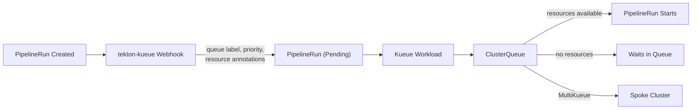

Konflux at scale generates a high volume of Tekton PipelineRuns — builds,
integration tests, release pipelines, and dependency updates all create
PipelineRun objects on the cluster. Without scheduling control, this volume
can overwhelm the Kubernetes control plane.

Konflux addresses this with [Kueue](https://kueue.sigs.k8s.io/docs/), a
Kubernetes-native job queuing system, and
[tekton-kueue](https://github.com/konflux-ci/tekton-kueue), a controller that
bridges Tekton PipelineRuns to Kueue. Together they gate PipelineRun admission,
assign priorities, manage external resource capacity, and optionally distribute
work across multiple clusters.

## Why Konflux needs queuing

**Protecting etcd and the control plane.** Every PipelineRun triggers the
creation of TaskRuns, Pods,and other dependent objects. A burst of
PipelineRuns can rapidly bloat the etcd database to the point where the cluster
stops functioning. Kueue gates admission so that only a controlled number of
PipelineRuns are active at any time, keeping etcd usage at safe levels and the
control plane healthy.

**Reducing PipelineRun timeouts.** Without queueing, a PipelineRun that starts
but cannot obtain the resources it needs will times out.
With Kueue, PipelineRuns wait in a queue and are admitted only when
sufficient resources are available, avoiding wasted timeout failures.

**Queuing on external resources.** Konflux multi-architecture builds use the
[multi-platform-controller](https://github.com/konflux-ci/multi-platform-controller)
to provision cloud virtual machines (for example, AWS EC2 instances) that live
outside the cluster. tekton-kueue declares these as custom Kueue resources via
CEL `resource()` expressions, so the ClusterQueue tracks finite VM capacity and
queues PipelineRuns until a slot opens instead of all pipelines competing for a
limited pool at once. The
[production configuration](#automatic-priority-and-resource-assignment) below
demonstrates this: CEL expressions inspect the `build-platforms` PipelineRun
parameter and emit resource requests for platform-specific slots (for example,
`linux-arm64`) and `aws-ip` addresses.

**Multi-cluster load distribution.** Kueue's
[MultiKueue](https://kueue.sigs.k8s.io/docs/concepts/multikueue/) feature can
dispatch PipelineRuns to spoke/worker clusters, distributing load across the
infrastructure.

**Priority-based scheduling.** Different PipelineRun types — releases,
post-merge builds, pre-merge tests, dependency updates — carry different
priorities so that critical workloads are scheduled first. See
[Workload Priority Classes](#workload-priority-classes) below for the full
priority tier definition.

## How it works



When a PipelineRun is created, the tekton-kueue admission webhook intercepts it,
sets it to `Pending`, and applies a queue label, priority class, and resource
request annotations based on configurable CEL expressions. The tekton-kueue
controller then creates a corresponding Kueue `Workload` object. Kueue evaluates
the Workload against the ClusterQueue's resource quotas and, when sufficient
capacity is available, admits it. The controller then un-pauses the PipelineRun
so Tekton can execute it. If MultiKueue is enabled, the Workload may instead be
dispatched to a spoke cluster.

For full details on the tekton-kueue webhook, controller, and CEL configuration
reference, see the
[tekton-kueue documentation](https://github.com/konflux-ci/tekton-kueue).

## Example: Kueue queue configuration

A working Kueue setup requires three resources: a `ResourceFlavor`, a
`ClusterQueue` with quotas, and a `LocalQueue` in each tenant namespace. The
tekton-kueue webhook automatically assigns PipelineRuns to the LocalQueue named
`pipelines-queue` (configurable via the `queueName` field in the tekton-kueue
ConfigMap).

The following example limits the cluster to 200 concurrent PipelineRuns. For
the full reference on these resources, see the
[Kueue concepts documentation](https://kueue.sigs.k8s.io/docs/concepts/).

```yaml
apiVersion: kueue.x-k8s.io/v1beta1
kind: ResourceFlavor
metadata:
  name: default-flavor
---
apiVersion: kueue.x-k8s.io/v1beta1
kind: ClusterQueue
metadata:
  name: cluster-pipeline-queue
spec:
  queueingStrategy: BestEffortFIFO
  namespaceSelector: {}
  resourceGroups:
    - coveredResources: ["tekton.dev/pipelineruns"]
      flavors:
        - name: default-flavor
          resources:
            - name: "tekton.dev/pipelineruns"
              nominalQuota: 200
```

tekton-kueue automatically adds a `tekton.dev/pipelineruns` resource request
(with a value of 1) to every Workload it creates, so the `nominalQuota` of 200
caps the cluster at 200 concurrent PipelineRuns. Any additional PipelineRuns
wait in the queue until a slot opens.

Each tenant namespace needs a `LocalQueue` named `pipelines-queue` that points
to the ClusterQueue:

```yaml
apiVersion: kueue.x-k8s.io/v1beta1
kind: LocalQueue
metadata:
  name: pipelines-queue
  namespace: my-team-tenant
spec:
  clusterQueue: cluster-pipeline-queue
```

Create one `LocalQueue` per tenant namespace. All of them reference the same
`ClusterQueue`, so quotas are shared across the cluster.

## Workload priority classes

Konflux defines a tiered set of `WorkloadPriorityClass` resources so that Kueue
schedules the most important work first. Higher values mean higher priority.

| Priority Class | Value | Description |
|---|---|---|
| `konflux-release` | 1000 | Managed release pipelines |
| `konflux-tenant-release` | 900 | Tenant release pipelines |
| `konflux-post-merge-test` | 800 | Post-merge integration tests |
| `konflux-post-merge-build` | 700 | Post-merge builds |
| `konflux-pre-merge-test` | 600 | Pre-merge integration tests |
| `konflux-pre-merge-build` | 500 | Pre-merge builds |
| `konflux-default` | 400 | Default for unclassified pipelines |
| `konflux-dependency-update` | 300 | Dependency update (mintmaker) builds |

The full manifest:

```yaml
---
apiVersion: kueue.x-k8s.io/v1beta1
kind: WorkloadPriorityClass
metadata:
  name: konflux-release
value: 1000
description: "Highest priority for release pipelines"
---
apiVersion: kueue.x-k8s.io/v1beta1
kind: WorkloadPriorityClass
metadata:
  name: konflux-tenant-release
value: 900
description: "High priority for tenant release pipelines"
---
apiVersion: kueue.x-k8s.io/v1beta1
kind: WorkloadPriorityClass
metadata:
  name: konflux-post-merge-test
value: 800
description: "Priority for post-merge tests"
---
apiVersion: kueue.x-k8s.io/v1beta1
kind: WorkloadPriorityClass
metadata:
  name: konflux-post-merge-build
value: 700
description: "Priority for post-merge builds"
---
apiVersion: kueue.x-k8s.io/v1beta1
kind: WorkloadPriorityClass
metadata:
  name: konflux-pre-merge-test
value: 600
description: "Priority for pre-merge tests"
---
apiVersion: kueue.x-k8s.io/v1beta1
kind: WorkloadPriorityClass
metadata:
  name: konflux-pre-merge-build
value: 500
description: "Priority for pre-merge builds"
---
apiVersion: kueue.x-k8s.io/v1beta1
kind: WorkloadPriorityClass
metadata:
  name: konflux-default
value: 400
description: "Default priority for konflux pipelines"
---
apiVersion: kueue.x-k8s.io/v1beta1
kind: WorkloadPriorityClass
metadata:
  name: konflux-dependency-update
value: 300
description: "Lower priority for dependency updates"
```

## Automatic priority and resource assignment

The tekton-kueue webhook uses CEL expressions to automatically assign the
appropriate priority class and resource requests to every PipelineRun. This
makes scheduling decisions declarative and configurable without code changes.

The production configuration below demonstrates how Konflux classifies
PipelineRuns. For the CEL expression syntax and available functions (`priority()`,
`resource()`, and others), see the
[tekton-kueue documentation](https://github.com/konflux-ci/tekton-kueue).

```yaml
queueName: pipelines-queue
cel:
  expressions:
    # Set resource requests for multi platform pipelines
    - |
        has(pipelineRun.spec.params) &&
        pipelineRun.spec.params.exists(p, p.name == 'build-platforms') ?
        pipelineRun.spec.params.filter(
          p,
          p.name == 'build-platforms')[0]
        .value.map(
          p,
          resource(replace(replace(p, "/", "-"), "_", "-"), 1)
        ) : []

    # Request AWS IP for AWS-based platforms
    - |
        has(pipelineRun.spec.params) &&
        pipelineRun.spec.params.exists(p, p.name == 'build-platforms') ?
        pipelineRun.spec.params.filter(
          p,
          p.name == 'build-platforms')[0]
        .value.filter(
          p,
          !(
            p in [
              'linux/ppc64le',
              'linux/s390x',
              'linux/x86_64',
              'local',
              'localhost',
            ]
          )
        ).map(
          p,
          resource('aws-ip', 1)
        ) : []

    # Set resource requests for multi platform pipelines which doesn't use the build-platforms parameter (old style)
    - |
      !(
        has(pipelineRun.spec.params) &&
        pipelineRun.spec.params.exists(p, p.name == 'build-platforms')
      ) &&
      has(pipelineRun.spec.pipelineSpec) &&
      has(pipelineRun.spec.pipelineSpec.tasks) &&
      pipelineRun.spec.pipelineSpec.tasks.size() > 0 ?
      pipelineRun.spec.pipelineSpec.tasks.map(
        task,
        has(task.params) ? task.params.filter(p, p.name == 'PLATFORM') : []
      )
      .filter(p, p.size() > 0)
      .map(
        p,
        resource(replace(replace(p[0].value, "/", "-"), "_", "-"), 1)
      ) : []

    # Request AWS IP for AWS-based platforms which doesn't use the build-platforms parameter (old style)
    - |
      !(
        has(pipelineRun.spec.params) &&
        pipelineRun.spec.params.exists(p, p.name == 'build-platforms')
      ) &&
      has(pipelineRun.spec.pipelineSpec) &&
      has(pipelineRun.spec.pipelineSpec.tasks) &&
      pipelineRun.spec.pipelineSpec.tasks.size() > 0 ?
      pipelineRun.spec.pipelineSpec.tasks.map(
        task,
        has(task.params) ? task.params.filter(p, p.name == 'PLATFORM') : []
      )
      .filter(p, p.size() > 0)
      .filter(
        p,
        !(
          p[0].value in [
            'linux/ppc64le',
            'linux/s390x',
            'linux/x86_64',
            'local',
            'localhost',
          ]
        )
      )
      .map(
        p,
        resource('aws-ip', 1)
      ) : []

    # Set mintmaker resource requests.
    # Necessary since mintmaker refreshes can overload clusters without a
    # bottleneck on the number of pipelineruns running.
    - |
        plrNamespace == 'mintmaker' ? [resource('mintmaker', 1)] : []

    # Set the pipeline priority
    - |
        has(pipelineRun.metadata.labels) &&
        'build.appstudio.openshift.io/type' in pipelineRun.metadata.labels &&
        pipelineRun.metadata.labels['build.appstudio.openshift.io/type'] == 'nudge' ?
        priority('konflux-dependency-update') :

        pacEventType == 'push' ? priority('konflux-post-merge-build') :
        pacEventType == 'pull_request' ||
          pacEventType == "Merge_Request" ||
          pacEventType == 'test-comment' ||
          pacEventType == 'retest-comment' ||
          pacEventType == 'retest-all-comment' ||
          pacEventType == 'ok-to-test-comment'  ? priority('konflux-pre-merge-build') :
        pacTestEventType == 'push' ? priority('konflux-post-merge-test') :
        pacTestEventType == 'pull_request' ||
          pacTestEventType == "Merge_Request" ||
          pacTestEventType == 'test-comment' ||
          pacTestEventType == 'retest-comment' ||
          pacTestEventType == 'retest-all-comment' ||
          pacTestEventType == 'ok-to-test-comment' ? priority('konflux-pre-merge-test') :

        has(pipelineRun.metadata.labels) &&
        'appstudio.openshift.io/service' in pipelineRun.metadata.labels &&
        pipelineRun.metadata.labels['appstudio.openshift.io/service'] == 'release' &&
        'pipelines.appstudio.openshift.io/type' in pipelineRun.metadata.labels &&
        pipelineRun.metadata.labels['pipelines.appstudio.openshift.io/type'] == 'managed' ?
        priority('konflux-release') :

        has(pipelineRun.metadata.labels) &&
        'appstudio.openshift.io/service' in pipelineRun.metadata.labels &&
        pipelineRun.metadata.labels['appstudio.openshift.io/service'] == 'release' &&
        'release.appstudio.openshift.io/namespace' in pipelineRun.metadata.labels &&
        pipelineRun.metadata.labels['release.appstudio.openshift.io/namespace'] == plrNamespace ?
        priority('konflux-tenant-release') :

        plrNamespace == 'mintmaker' ? priority('konflux-dependency-update') :

        has(pipelineRun.metadata.labels) &&
        'internal-services.appstudio.openshift.io/pipelinerun-uid' in pipelineRun.metadata.labels ?
        priority('konflux-release') :

        priority('konflux-default')
```

### What this configuration does

**Multi-platform resource requests.** The first four expressions handle
multi-architecture builds. When a PipelineRun specifies a `build-platforms`
parameter (for example, `["linux/arm64", "linux/s390x"]`), each platform is
converted to a custom resource request. Platforms that run on AWS-provisioned
virtual machines also request an `aws-ip` resource slot. This ensures that
PipelineRuns are queued when all available VMs of a given architecture are in
use. A fallback path handles older pipelines that specify platforms at the task
level instead of via `build-platforms`.

**Mintmaker throttling.** PipelineRuns in the `mintmaker` namespace
([MintMaker](https://github.com/konflux-ci/mintmaker) is the Konflux dependency
update service) request a dedicated `mintmaker` resource. By setting a quota on
this resource in the ClusterQueue, the cluster limits how many dependency-update
PipelineRuns run concurrently, preventing mintmaker refresh storms from crowding
out other workloads.

**Priority assignment.** The final expression classifies each PipelineRun into
one of the [priority tiers](#workload-priority-classes) using Pipelines-as-Code
and Integration Service event-type labels:

- **Dependency updates** (`build.appstudio.openshift.io/type: nudge`) receive
  the lowest priority (`konflux-dependency-update`).
- **Build PipelineRuns** triggered by Pipelines-as-Code are split into
  post-merge (`push` events, `konflux-post-merge-build`) and pre-merge
  (`pull_request` and related events, `konflux-pre-merge-build`).
- **Integration test PipelineRuns** follow the same split using the integration
  test event-type label (`konflux-post-merge-test` / `konflux-pre-merge-test`).
- **Managed release pipelines** (identified by the `release` service label and
  `managed` type) receive the highest priority (`konflux-release`).
- **Tenant release pipelines** (release service running in the PipelineRun's own
  namespace) receive `konflux-tenant-release`.
- **Internal service PipelineRuns** (identified by the
  `internal-services.appstudio.openshift.io/pipelinerun-uid` label) also receive
  `konflux-release` priority.
- Everything else falls back to `konflux-default`.

## Further reading

> **Note:** Kueue, tekton-kueue, multi-platform-controller, and MintMaker are
> not deployed by the Konflux operator. They are deployed and
> configured separately.

- [Kueue documentation](https://kueue.sigs.k8s.io/docs/)
- [tekton-kueue repository](https://github.com/konflux-ci/tekton-kueue)
- [Kueue MultiKueue](https://kueue.sigs.k8s.io/docs/concepts/multikueue/)
- [multi-platform-controller](https://github.com/konflux-ci/multi-platform-controller) — orchestrates remote VMs for multi-architecture builds
- [MintMaker](https://github.com/konflux-ci/mintmaker) — Konflux dependency update service (Renovate-based)
