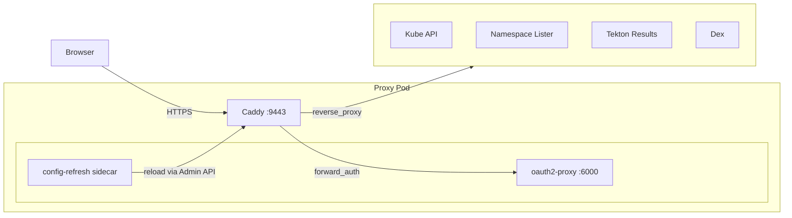
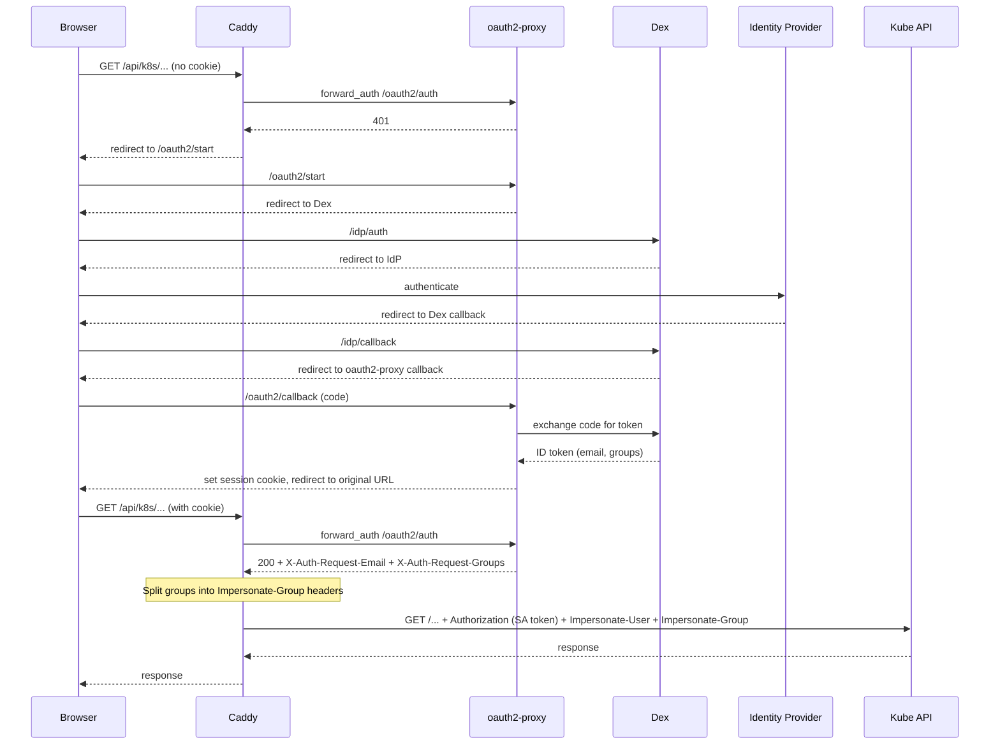

# UI

## Overview

This component deploys the Konflux UI, which includes a static SPA, a
Caddy-based reverse proxy, oauth2-proxy for authentication, and Dex as
the identity broker.

## Dependencies

Dex is required for oauth2-proxy to be deployed.

---

# Proxy Architecture

The proxy is a Caddy-based reverse proxy that sits in front of the
Kubernetes API, backend services (Tekton Results, KubeArchive), and the
static SPA. It handles TLS termination, authentication (via oauth2-proxy),
user/group impersonation, and dynamic token management.

## Architecture



## Pod Structure

The proxy runs as a Kubernetes `Deployment` with three containers and two
init containers:

| Container | Type | Image | Purpose |
|-----------|------|-------|---------|
| `copy-static-content` | Init | `konflux-ui` | Copies SPA assets to emptyDir |
| `generate-proxy-config` | Init | `konflux-ui` | Resolves backends, seeds auth snippets and TLS config |
| `reverse-proxy` | Main | `caddy` | Caddy server on :9443 (HTTPS) and :2112 (metrics) |
| `oauth2-proxy` | Main | `oauth2-proxy` | OIDC authentication on :6000 |
| `config-refresh` | Sidecar | `konflux-ui` | Watches tokens and CAs, reloads Caddy via admin API |

## Request Flow

Every authenticated request follows this path:

```
Browser ──HTTPS──▶ Caddy (:9443)
                     │
                     ├─ Strip Impersonate-*/X-User/X-Group headers (prevent spoofing)
                     │
                     ├─ Match route (handle_path / handle / @matcher)
                     │
                     ├─ forward_auth ──▶ oauth2-proxy (:6000)
                     │                    │
                     │                    ├─ Has valid session cookie? ──▶ 200 + X-Auth-Request-Email
                     │                    │                                    + X-Auth-Request-Groups
                     │                    └─ No cookie? ──▶ 401 (Caddy returns login redirect)
                     │
                     ├─ map: split X-Auth-Request-Groups into {ig1}..{ig10}
                     │
                     ├─ request_header: set Impersonate-User / +Impersonate-Group headers
                     │
                     └─ reverse_proxy ──▶ upstream (Kube API / Tekton Results / etc.)
```

## Authentication Flow

Users authenticate via OIDC. The proxy never sees credentials directly —
authentication is fully delegated to oauth2-proxy and Dex.



### Step by step

1. **First request (no session):** The browser hits a Kube API route.
   Caddy's `forward_auth` sends a subrequest to oauth2-proxy, which
   returns 401 (no valid cookie). Caddy redirects the browser to start
   the OIDC flow.

2. **OIDC flow:** oauth2-proxy redirects the browser to Dex, which
   redirects to the configured identity provider (GitHub, LDAP, OIDC,
   etc.). After the user authenticates, the browser follows callbacks
   back through Dex to oauth2-proxy, which exchanges the authorization
   code for an ID token containing the user's email and group memberships.

3. **Session established:** oauth2-proxy sets an encrypted session cookie
   and redirects the browser back to the original URL.

4. **Subsequent requests (with session):** Caddy's `forward_auth` sends
   a subrequest to oauth2-proxy, which validates the cookie and returns
   200 with `X-Auth-Request-Email` and `X-Auth-Request-Groups` headers.
   Caddy copies these onto the request, splits the groups into individual
   `Impersonate-Group` headers (see [Group Impersonation](#group-impersonation)),
   and forwards the request to the Kube API with the proxy's own service
   account token in the `Authorization` header.

5. **Kube API impersonation:** The API server authenticates the proxy's
   service account, verifies it has impersonation permissions, and then
   processes the request as if it came from the impersonated user with
   the specified groups.

## Group Impersonation

The Kubernetes API requires each group as a separate `Impersonate-Group`
header. oauth2-proxy returns all groups in a single comma-separated string.

Splitting is done in two steps:

1. **`impersonate-groups.conf`** — a `map` directive that extracts up to 10
   groups from `X-Auth-Request-Groups` into placeholders `{ig1}`…`{ig10}`
   using a regex with capture groups.

2. **`impersonate-headers.conf`** — `request_header +Impersonate-Group`
   directives that add one header per placeholder, plus a static
   `system:authenticated` group.

`request_header` is used instead of `header_up` because Caddy's
reverse_proxy merges all `header_up` operations for the same header name
into a single set/add/delete sequence, which causes only the first value
to survive. Using `request_header` as a standalone handler avoids this.

All Kube API and backend routes are wrapped in `route { }` blocks to
preserve execution order (`forward_auth` → `map` → `request_header` →
`reverse_proxy`), since Caddy's default directive ordering would run `map`
before `forward_auth`.

### Design Trade-offs

We evaluated several approaches before settling on the `map` + `request_header`
pattern. The core challenge is that Caddy has no built-in way to explode a
single comma-separated header into multiple headers with the same name.

**Approach 1: `header_up` with newline injection** — Replace commas with
`\nImpersonate-Group: ` inside a `header_up` directive. Rejected because
Go's `net/http` sanitizes newlines in header values to prevent HTTP header
injection. The `\n` is stripped before the request reaches the upstream.

**Approach 2: Custom Caddy plugin / CEL handler** — Write a plugin or use
Caddy's CEL expression language to split the header programmatically.
Rejected because it adds a build-time dependency (custom Caddy build) or
relies on CEL features that are experimental in Caddy. Both would
complicate the supply chain and make the proxy harder to maintain.

**Approach 3: Helper sidecar** — Run a small HTTP service between Caddy
and the upstream that splits the header. Rejected because it adds another
hop (latency, failure mode, resource cost) for every API request, and
complicates the pod topology.

**Approach 4 (chosen): `map` with regex capture groups + `request_header`** —
Use a `map` directive with a regex containing 10 optional capture groups to
extract individual groups into placeholders, then add each as a separate
header via `request_header +Impersonate-Group`. Trade-offs:

- *Pro*: Pure Caddyfile, no custom builds, no extra sidecars, no latency
  overhead.
- *Pro*: Empty capture groups produce empty placeholders, which the
  Kubernetes API server silently ignores — no harm from unused slots.
- *Con*: Hard cap of 10 groups. Increasing the cap is straightforward
  (add more capture groups and `request_header` lines) but increases config
  verbosity. The regex is already complex at 10 groups.
- *Con*: `request_header` must be used instead of the more natural
  `header_up` (inside `reverse_proxy`) due to Caddy's header operation
  merging. This requires explicit `route { }` blocks to control execution
  order, making the Caddyfile less intuitive.

The 10-group cap is a pragmatic choice. In practice, most identity
providers return fewer than 10 groups per user. If a deployment needs more,
the cap can be raised by adding entries to `impersonate-groups.conf` and
`impersonate-headers.conf`.

### Limitations

- Maximum of 10 groups per user. Groups beyond the 10th are silently
  dropped. The cap can be raised by extending the regex and adding
  `request_header` lines.
- Group changes in the identity provider (Dex) require the user to log out
  and log back in to get a fresh ID token.

## Token Management

Two projected service account tokens are mounted into the pod:

| Volume | Audience | Path | Purpose |
|--------|----------|------|---------|
| `kube-api-token` | *(default)* | `/var/run/secrets/konflux-ci.dev/serviceaccount/token` | Kube API impersonation |
| `backend-token` | `konflux-backend` | `/var/run/secrets/konflux-ci.dev/backend/token` | Backend services (TokenReview) |

The `backend-token` uses a dedicated audience to enforce the principle of
least privilege. The proxy's `kube-api-token` carries impersonation
permissions — if that same token were forwarded to a backend service and
the backend were compromised, an attacker could use it to impersonate any
user against the Kubernetes API. The `konflux-backend` audience token is
rejected by the Kube API for direct operations, limiting the blast radius
to TokenReview-based identity verification only.

The backend token infrastructure is in place but not yet active: Tekton
Results currently does not support custom audiences in its TokenReview
calls, so the proxy falls back to `kube-auth.conf` for now. We opened
[tektoncd/results#1331](https://github.com/tektoncd/results/issues/1331)
to request this capability upstream. Once supported, switching to the
backend token requires changing a single `import` line in the backend's
Caddy snippet (see the TODO in `tekton-results.caddy`).

### Refresh Cycle

The **config-refresh** sidecar runs every 10 seconds and:

1. Reads both token files.
2. Compares against the last known value.
3. If either token changed, writes the corresponding Caddy snippet
   (`kube-auth.conf` or `backend-auth.conf`).
4. Reads all mounted CA certificate files and compares their combined
   content against the last known state.
5. If any token or CA content changed, reloads Caddy via
   `POST /load` on the admin API.

CA files watched:
- `/var/run/secrets/kubernetes.io/serviceaccount/ca.crt` (Kube API CA)
- `/mnt/trusted-ca/ca-bundle.crt` (namespace-lister CA via trust-manager)
- `/mnt/ca.crt` (Dex CA from cert-manager)
- `/mnt/service-ca/service-ca.crt` (OpenShift service CA, optional)

## Extensible Backends

Backend services (Tekton Results, KubeArchive, etc.) are added via
**Caddy snippet templates** and an **init container**:

1. Templates live in ConfigMaps mounted at `/mnt/caddy-templates/`
   (e.g. `tekton-results.caddy`). They use placeholders like
   `__TEKTON_RESULTS_HOSTNAME__`.

2. The `generate-proxy-config` init container resolves hostnames via DNS,
   substitutes placeholders, and writes rendered snippets to
   `/mnt/caddy-snippets/`.

3. The Caddyfile imports all rendered snippets via:
   ```
   import /mnt/caddy-snippets/*.caddy
   ```

4. If a backend is not available (DNS resolution fails), its snippet is
   simply not generated and Caddy starts without that route.

To add a new backend:

1. Create a template file (e.g. `kubearchive.caddy`) following the
   `tekton-results.caddy` pattern.
2. Add it to the `proxy-caddy-templates` ConfigMap in `kustomization.yaml`.
3. Add hostname resolution logic to `generate-proxy-config.sh`.

## TLS and Certificates

Each upstream uses a different trust anchor:

| Upstream | CA Source | Config |
|----------|-----------|--------|
| Kubernetes API | Mounted SA CA | `tls_trust_pool file /var/run/secrets/kubernetes.io/serviceaccount/ca.crt` |
| Dex | cert-manager Secret | `tls_trust_pool file /mnt/ca.crt` |
| Namespace-lister | trust-manager ConfigMap | `tls_trust_pool file /mnt/trusted-ca/ca-bundle.crt` |
| Backend services | Platform-dependent | `import /mnt/caddy-snippets/backend-tls.conf` |

Backend TLS is determined at init time by `generate-proxy-config.sh`:
- **OpenShift**: uses the service CA from `openshift-service-ca.crt` ConfigMap
  (auto-injected by the service-ca-operator).
- **Other platforms**: falls back to `tls_insecure_skip_verify`. To use
  proper verification, deploy cert-manager and configure it to issue
  certificates trusted by the proxy.

## Metrics

Caddy exposes native Prometheus metrics on `:2112/metrics`. A TODO exists
to protect this endpoint with
[kube-rbac-proxy](https://github.com/openshift/kube-rbac-proxy).

## File Reference

All proxy files live under `core/proxy/`:

| File | Purpose |
|------|---------|
| `Caddyfile` | Main server configuration |
| `impersonate-groups.conf` | `map` directive splitting comma-separated groups |
| `impersonate-headers.conf` | `request_header` directives for Kube API impersonation |
| `ns-lister-headers.conf` | `request_header` directives for namespace-lister (X-User/X-Group) |
| `tekton-results.caddy` | Template for Tekton Results backend route |
| `generate-proxy-config.sh` | Init container script: resolves backends, seeds auth/TLS snippets |
| `config-refresh.sh` | Sidecar script: watches tokens and CAs, reloads Caddy |
| `config-refresh-probe.sh` | Liveness probe for the config-refresh sidecar |
| `proxy.yaml` | Deployment and Service manifests |
| `rbac.yaml` | ServiceAccount and RBAC for the proxy |
| `kustomization.yaml` | Kustomize overlay tying everything together |
